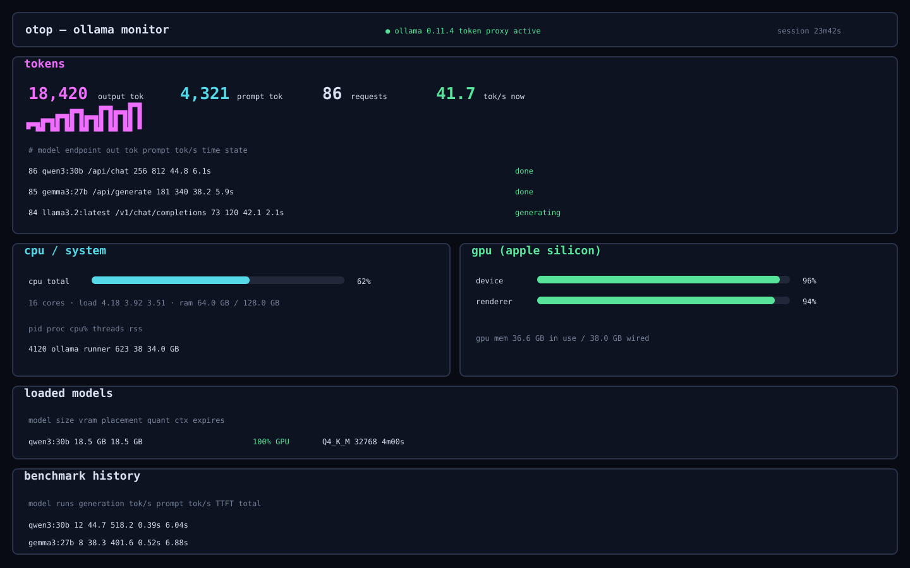
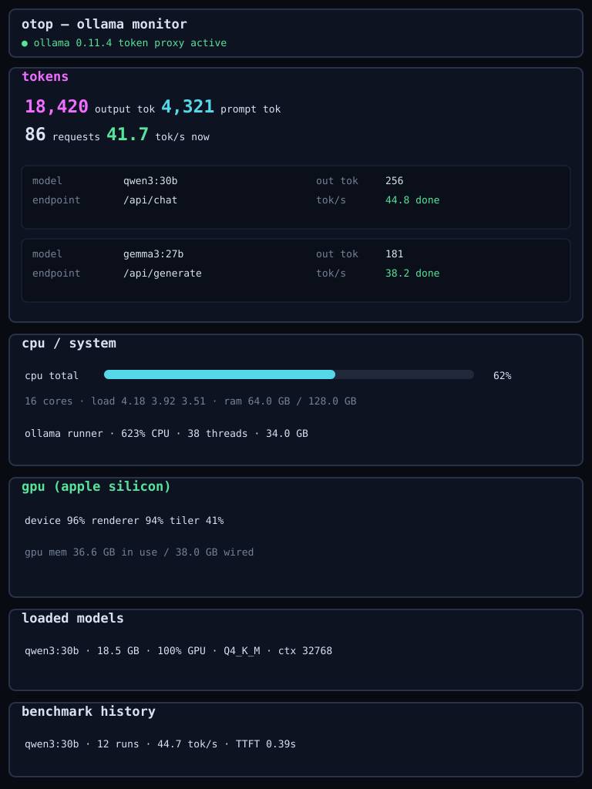

# Ollama Stats Proxy

A transparent, low-overhead Ollama proxy and benchmarking dashboard written in Swift with [Hummingbird](https://hummingbird.codes) and [GRDB](https://github.com/groue/GRDB.swift).

It streams Ollama responses to clients before asynchronously accounting for them, persists performance history in SQLite, and exposes an `otop`-inspired responsive dashboard and machine-readable APIs.

## Highlights

- Native Ollama NDJSON and OpenAI-compatible SSE/JSON proxying.
- Non-blocking metrics queue: parsing and SQLite writes are outside the response hot path.
- TTFT, prompt-evaluation tok/s, generation tok/s, load time, and total latency.
- Per-model historical summaries and repeatable labeled benchmark runs.
- Temperature, context length, and thinking-mode capture.
- Per-query average system CPU, Apple Silicon GPU, and used-memory capture with benchmark aggregates.
- CPU, RAM, process/thread, Apple Silicon GPU, VRAM, and loaded-model panels.
- Persistent SQLite history with JSON/CSV exports and retention controls.
- Responsive desktop, iPad, and phone dashboard.
- Live web-tool resource activity: LLM/direct caller, search queries, fetched URLs, latency, result counts, received bytes, and failures (metadata only; page contents are not retained).



<details><summary>iPad layout</summary>



</details>

## Requirements and run

- macOS 14+, Swift 6.1+, and Ollama (normally `127.0.0.1:11434`).

```sh
swift run ollama-stats-proxy --host 0.0.0.0
```

The default listener is `127.0.0.1:11435`; `--host 0.0.0.0` makes it available on your LAN. Point clients at the proxy and open the dashboard:

```sh
OLLAMA_HOST=127.0.0.1:11435 ollama run llama3.2
export OPENAI_BASE_URL=http://127.0.0.1:11435/v1
open http://127.0.0.1:11435/monitor
```

## Repeatable benchmarks

The runner uses temperature `0`, seed `42`, a stable prompt, and a benchmark label:

```sh
chmod +x Scripts/benchmark.sh
Scripts/benchmark.sh llama3.2 5
```

Override inputs with `BENCHMARK_LABEL`, `BENCHMARK_PROMPT`, and `OLLAMA_PROXY_URL`. For useful comparisons, warm each model first, use identical options, close GPU-heavy applications, and separate cold-load results from warm runs.

## Endpoints

| Endpoint | Purpose |
| --- | --- |
| `GET /monitor` | Responsive dashboard |
| `GET /stats` | Live system, model, session, and recent-request JSON |
| `GET /healthz` | Ollama-aware health check |
| `GET /version` | Proxy name and semantic version |
| `GET /benchmarks` | Historical aggregates grouped by model |
| `POST /requests/:id/cancel` | Authenticated cancellation of an active completion |
| `GET /web-tools` | Persistent web-tool call history, linked to LLM requests |
| `GET /export.json` | Complete request history as JSON |
| `GET /export.csv` | Complete history as downloadable CSV |
| `DELETE /history` | Delete all completed history |
| `DELETE /history?olderThanDays=30` | Delete history older than 30 days |

See [docs/API.md](docs/API.md) for the schema.

## Options

```text
--host 127.0.0.1
--port 11435
--upstream http://127.0.0.1:11434
--database ./ollama-stats.sqlite
--history-limit 20
--max-body-mb 512
--retention-days N
--config ./ollama-stats-proxy.json
```

## Configuration

Web-tool settings are stored in `./ollama-stats-proxy.json` by default and can be edited from the collapsible **settings** panel in `/monitor`, including independently enabling or disabling URL fetching. Use `--config PATH` to choose another location. On first launch, the file is seeded from the web-tool command-line options and `OLLAMA_WEB_SEARCH_*` environment variables. Editable web-tool and authentication settings apply immediately to new requests; in-flight requests retain the snapshot they started with.

Set or override the administration password with `OLLAMA_ADMIN_PASSWORD`, or set one in the settings panel. An explicit environment password is applied even when the JSON file already exists. The file stores only a uniquely salted PBKDF2-HMAC-SHA256 password hash. Successful login creates a 12-hour, server-side session using an `HttpOnly; SameSite=Strict` cookie; the password and session token are never placed in browser storage. Changing the password invalidates existing sessions.

The administration username is always `admin`. The login form uses standard browser password-manager fields, so Safari, Chrome, 1Password, Bitwarden, and similar tools can offer to save and autofill the credential without the monitor storing it in JavaScript-accessible browser storage.

The configuration file may contain a search-provider API key and is created with owner-only permissions. The web API never returns the key itself, only whether one is configured. Authentication does not encrypt plain HTTP traffic, so use localhost or an HTTPS reverse proxy rather than exposing administration over an untrusted network.

Page fetching permits only public HTTP/HTTPS destinations by default. Loopback, private, link-local, multicast, and other non-public address ranges are rejected, and every redirect target is revalidated. The settings panel can deliberately allow private/local destinations, but doing so lets models and direct callers reach services on your LAN.

## Privacy

The proxy stores performance metadata plus web search queries and fetched resource URLs. It does **not** persist prompts, chat messages, generated text, fetched page contents, search-result snippets, authorization headers, or client IP addresses. Exports contain only the metadata held in SQLite.

Binding to `0.0.0.0` exposes the proxy, dashboard statistics, history exports, and direct web-tool endpoints to your local network. Administration settings and history deletion are password protected when an admin password is configured, but the proxy itself is intentionally not a multi-user authentication gateway. Use a firewall, localhost, or an authenticated HTTPS reverse proxy on untrusted networks.

## Development

```sh
node --check Sources/OllamaStatsProxy/Public/dashboard.js
swift test
swift build
bash Scripts/integration-test.sh
```

The integration test launches a mock streaming Ollama server and verifies byte forwarding and final metric reconciliation. GitHub Actions runs all three commands on macOS.

Inspired by [TiniLLM/ollama-token-monitor](https://github.com/TiniLLM/ollama-token-monitor). MIT licensed; see [LICENSE](LICENSE).

## Optional web tools

The proxy can expose lightweight search and page-fetch tools without Docker or another AI framework. These endpoints are intentionally separate from the transparent Ollama proxy, so existing clients and Xcode tool calls are not modified.

Supported search providers are Brave Search, Tavily, and SearXNG:

```sh
# Brave
export OLLAMA_WEB_SEARCH_PROVIDER='brave'
export OLLAMA_WEB_SEARCH_API_KEY='...'
swift run ollama-stats-proxy --host 0.0.0.0

# Tavily
export OLLAMA_WEB_SEARCH_PROVIDER='tavily'
export OLLAMA_WEB_SEARCH_API_KEY='...'
swift run ollama-stats-proxy --host 0.0.0.0

# SearXNG (no key required; URL must point at an instance with JSON output enabled)
export OLLAMA_WEB_SEARCH_PROVIDER='searxng'
export OLLAMA_WEB_SEARCH_URL='http://127.0.0.1:8080/search'
swift run ollama-stats-proxy --host 0.0.0.0
```

Use the tools directly:

```sh
curl -G 'http://127.0.0.1:11435/tools/web/search' \
  --data-urlencode 'q=Swift 6.3 concurrency changes' \
  --data-urlencode 'count=5'

curl -G 'http://127.0.0.1:11435/tools/web/fetch' \
  --data-urlencode 'url=https://www.swift.org/'
```

`fetch` accepts public HTTP/HTTPS URLs, converts common HTML structure and links to Markdown, and truncates returned text (50,000 characters by default). Private-network access is blocked unless explicitly enabled in settings. Adjust limits with `--web-fetch-max-mb` and `--web-fetch-max-chars`.

These endpoints are the building blocks for agent/tool integration: a chat client or MCP/tool adapter can expose them to a tool-capable Ollama model as `search_web` and `fetch_url`. The proxy deliberately does not inject tools into every `/api/chat` or `/v1/chat/completions` request, because doing so would interfere with clients such as Xcode that already manage their own tool schemas and tool-call loop.

## Generic server-owned tool orchestration

The proxy advertises its page-fetch tool on both supported chat protocols. When a web search provider is configured, it advertises the search tool as well:

- `POST /v1/chat/completions` (OpenAI-compatible)
- `POST /api/chat` (native Ollama)

The implementation is deliberately client-agnostic. Proxy-owned tools use a reserved namespace:

- `ollama_proxy_search_web`
- `ollama_proxy_fetch_url`

Any other tool name is considered **client-owned**. The proxy never executes or consumes those calls; it returns them to the client unchanged. This lets coding IDEs, chat applications, agent frameworks, and future clients supply arbitrary tools without OllamaStatsProxy needing client-specific code.

The flow is:

```text
Any compatible client
        |
        v
OllamaStatsProxy
  |           |
  |           +-- ollama_proxy_* -> executed internally
  |
  +-------------- unknown/client tools -> returned to client
        |
        v
      Ollama
```

`ollama_proxy_fetch_url` is available without any search-provider configuration. `ollama_proxy_search_web` requires `--web-search-provider` and its corresponding credentials or URL.

If the model calls only proxy-owned tools, the proxy executes them, appends the tool results to the conversation, and asks Ollama to continue. It repeats this for up to four internal tool rounds by default. Change the limit with:

```sh
--server-tool-rounds 6
```

Disable automatic server tools globally with:

```sh
--no-server-tools
```

A particular request can opt out without changing the server by adding this top-level request field:

```json
{
  "ollama_proxy_tools": false
}
```

The field is removed before forwarding to Ollama.

### Streaming compatibility

Internal tool orchestration has to inspect a complete model turn before it can know whether the model requested a server-owned tool. For that reason, when server-owned tools are enabled, chat responses are currently **buffered per model turn** and then replayed in the client's requested OpenAI SSE or Ollama NDJSON envelope. Client-owned tool calls remain intact, but token-by-token display begins after the model turn has completed.

This is a protocol tradeoff rather than a client-specific limitation. A future version can add speculative/live streaming once it is safe to distinguish visible text from an internal tool call without leaking tool-call turns to the client.
